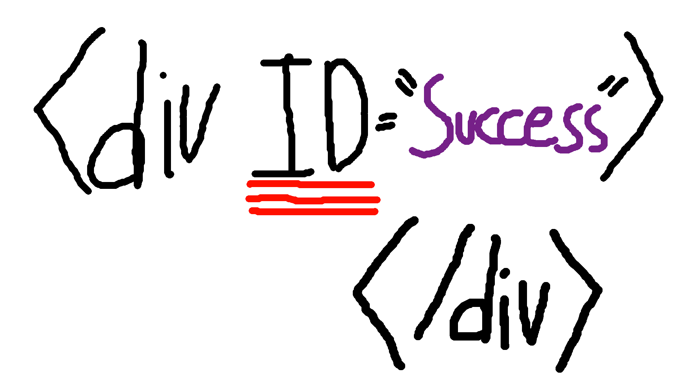

# Team Success

# Launch Codes:

1. Clone this repo:
`git clone git@github.com:DanielYentin/adlibs-madibs.git`

2. Cd into the directory:
`cd adlibs-madlibs/`

3. Install all dependencies:
`pip install -r requirements.txt`

4. Cd into the app folder of the directory
`cd app/`

5. Run the init python file:
`python3 __init__.py`
